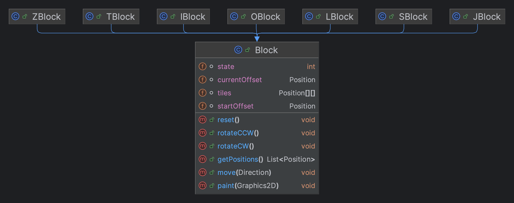
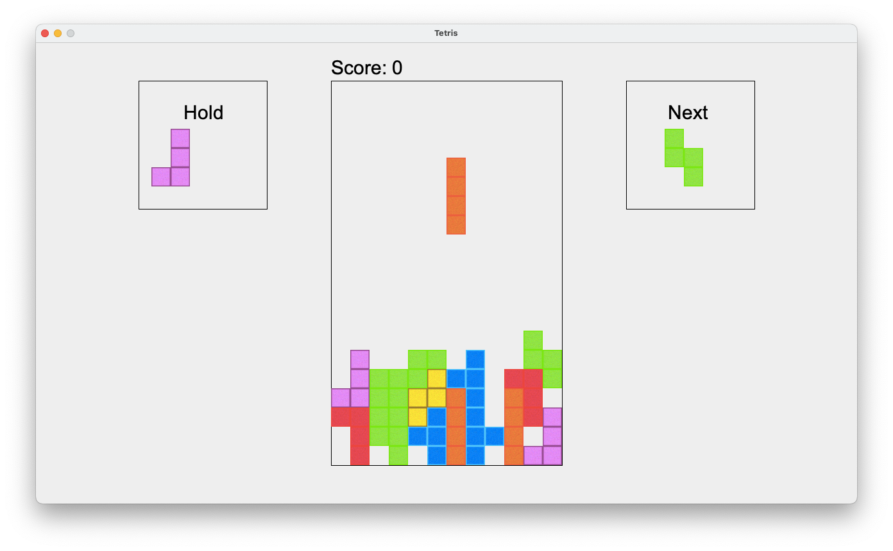

# Tetris

## Vai trò của các lớp

- GameManager sẽ quản lý toàn bộ các thành phần trong game như game loop
- GameState sẽ quản lý các trạng thái của game như số điểm, tốc độ rơi của khối, lưu trữ khối hiện tại, đang giữ và tiếp
  theo
- BlockQueue sẽ giúp đỡ trong việc quản lý danh sách khối, sẽ phụ trách cả việc lựa trọn khối tiếp theo
- GameGrid sẽ quản lý vị trí của các khối dựa vào ma trận 2 chiều
- Các lớp trong package Helper sẽ giúp viết code đơn giản và dễ hiểu hơn
- Các lớp trong package Block sẽ định nghĩa các khối sẽ được biểu diễn như thế nào

---

## Sơ đồ mô hình quản lý các khối

<div style="text-align:center">
  
</div>

Mô hình quản lý các khối trong game Tetris có thể được chia thành các thành phần chính sau:

- Tiles: Mỗi khối trong Tetris có một hình dạng và màu sắc riêng.
  Có 7 hình dạng phổ biến bao gồm I, O, T, S, Z, J và L.
  Mỗi khối được biểu diễn bằng một ma trận gồm các ô vuông (Tile),
  trong đó mỗi ô vuông có thể có hoặc không có màu.
- startOffset: biểu diễn vị trí bắt đầu, xuất hiện của khối
- currentOffset: biểu diễn vị trí hiện tại của khối
- state: biểu diễn trạng thái xoay của khối

các phương thức khác nhằm giúp ích cho việc quản lý vị trí của khối như xoay,
đặt lại vị trí, di chuyển sang trái phải lên xuống

---

## Game loop

```java
public void run() {
    double drawInterval = (double) 1_000_000_000 / Main.FPS;
    double delta = 0;
    long lastTime = System.nanoTime();
    long currentTime;

    while (gameThread != null) {
        currentTime = System.nanoTime();
        delta += (currentTime - lastTime) / drawInterval;
        lastTime = currentTime;

        if (delta >= 1) {
            update();
            repaint();
            delta--;
        }
    }
}
```

Với thuật toán này sẽ đảm bảo FPS đã được khai báo

---

### Tính năng đoán khối tiếp theo

Khi game bắt đầu sẽ hiển thị khối sẽ được xuất hiện tiếp theo sau khi khối hiện tại được đặt xuống

<div style="text-align:center">
  
</div>

---

### Tính năng giữ khối

Khi muốn giữ khối cần bấm [Space],
khối đó sẽ được lưu lại và hiển thị bên tay trái màn hình

Khi mới khởi tạo và chưa giữ khối nào

<div style="text-align:center">
  
</div>

Khi đã giữ khối

<div style="text-align:center">
  
</div>

---

### Áp dụng các hình ảnh đã thiết kế

<div style="text-align:center">
  
</div>

Việc load hình ảnh sẽ được thực thi khi dạng Block đó được tạo

```java
public KhoiMongMuon() {
    var _image = image = ImageIO.read(new File("src/assets/[màu mong muốn].jpg"));
    this.image = _image.getScaledInstance(Main.TILE_SIZE, Main.TILE_SIZE, Image.SCALE_SMOOTH);
}
```

Sau đó cần vẽ hình ảnh đúng với vị trí đã đặt của block

```java
private void drawBoard(Graphics2D graphics2D) {
    graphics2D.setColor(Color.BLACK);
    graphics2D.drawRect(LEFT_X, TOP_Y, BOARD_WIDTH, BOARD_HEIGHT);

    var gameGrid = gameState.gameGrid.gameGrid;
    for (int i = 0; i < gameGrid.length; i++) {
        var tile = gameGrid[i];
        for (int j = 0; j < tile.length; j++) {
            if (tile[j] == 0) continue;
            // tile[j] là id block
            graphics2D.setColor(Color.BLACK);
            Block block = gameState.blockQueue.blocks[tile[j] - 1];
            graphics2D.drawImage(block.image,
                    i * Main.TILE_SIZE + LEFT_X,
                    j * Main.TILE_SIZE,
                    null);
        }
    }
}
```

Kết quả

<div style="text-align:center">
  
</div>
